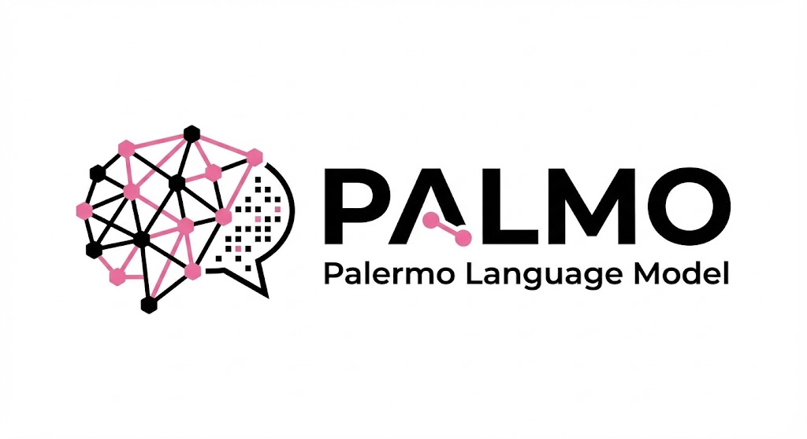
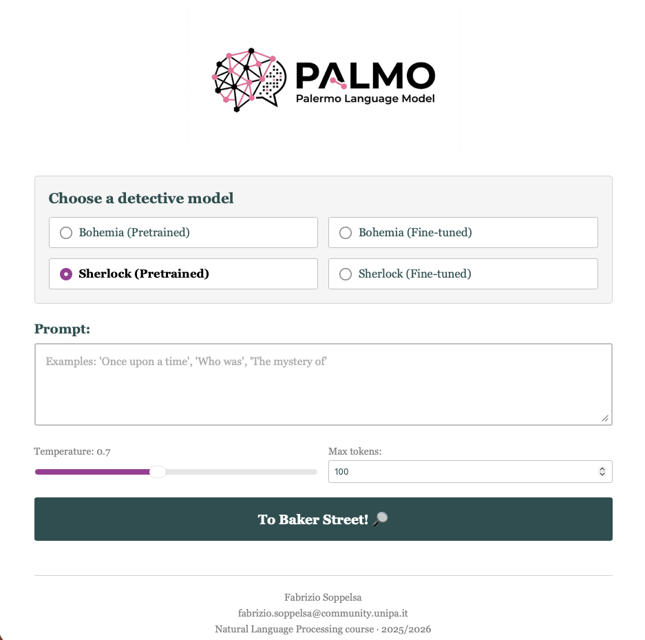

# Palmo



Palmo is my project for the 2025/2026 winter class of **Natural
Language Processing** in the Artificial Intelligence degree programme
at the University of Palermo. It is an educational, decoder-only
GPT-style small language model implemented from zero in PyTorch.

The project focuses on making the core parts of a language model explicit: Byte Pair Encoding (BPE), token and positional embeddings, causal multi-head self-attention, Transformer blocks, autoregressive pre-training, instruction fine-tuning, LoRA adapters, and dynamic INT8 quantization.

## Training corpus

Pre-training uses Arthur Conan Doyle's complete Sherlock Holmes canon. The corpus is assembled from public-domain source texts; the data itself is intentionally not included in this repository.

Fine-tuning uses instruction/response data derived for the project. Model weights, generated vocabularies, corpora, and fine-tuning data are local artifacts and are excluded from version control.

## Repository layout

```text
palmo/
├── src/               # Python implementation modules
│   ├── tokenizer.py   # Custom BPE tokenizer
│   ├── transformer.py # Decoder-only Transformer and causal attention
│   ├── pretraining.py # Dataset, training loop, and checkpoints
│   ├── finetune.py    # Instruction fine-tuning and LoRA utilities
│   ├── quantize.py    # Dynamic INT8 quantization
│   └── app.py         # Flask inference interface
├── main.ipynb         # End-to-end experiment notebook
├── pretrain/          # Command-line pre-training helpers
├── garak/             # Local Garak evaluation configuration
└── tests/             # Unit and exploratory tests
```

## Setup

```bash
python -m venv .venv
source .venv/bin/activate
pip install -r requirements.txt
```

Build the corpus locally before training:

```bash
python corpus/download-sherlock.py
```

Then run pre-training:

```bash
python pretrain/run_pretraining.py --corpus sherlock --epochs 20
```

For background training and monitoring commands, see [the pre-training guide](pretrain/README.md).

## Run the web interface

After placing a compatible checkpoint and vocabulary in the local `checkpoints/` and `data/` directories:

```bash
python -m src.app
```



## Tests

```bash
pytest
```

## Acknowledgements

The implementation is informed by Sebastian Raschka's *Build a Large Language Model (From Scratch)* and standard Transformer literature, especially *Attention Is All You Need* (Vaswani et al., 2017).
